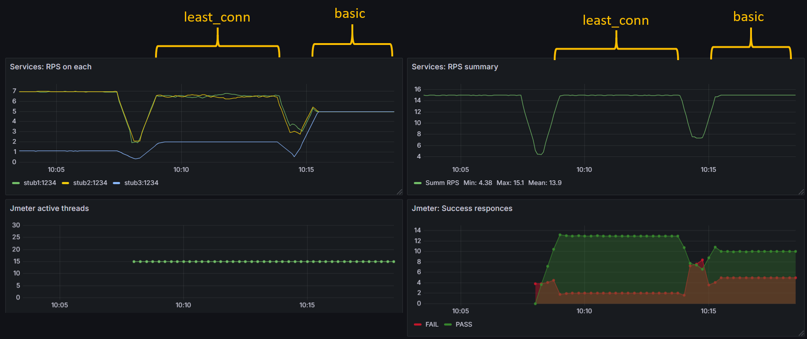

**least_conn VS basic balancer sample**

**_Стек_**\
docker-compose, dockerfile, prometheus, grafana, spring-boot, nginx

**_Запуск, использование_**\
Запуск с помощью docker compose. Поднимается 3 одинаковые заглушки с эндпоинтом /hello. Доступ к заглушкам через nginx на порту 80. С помощью compose.yaml можно скорректировать время ответа каждой заглушки (настройка задержки ответа). Посмотреть результаты можно на графане - для начала нужно сконфигурировать источник в виде прометея (prometheus:9090) и настроить дашборды.

**_Дополнительно_**\
Снабжён jmeter скриптом для имитации нагрузки.

**_\\ Timur Shamsrakhmanov \\_** \
**_\\ February 2025  \\_**